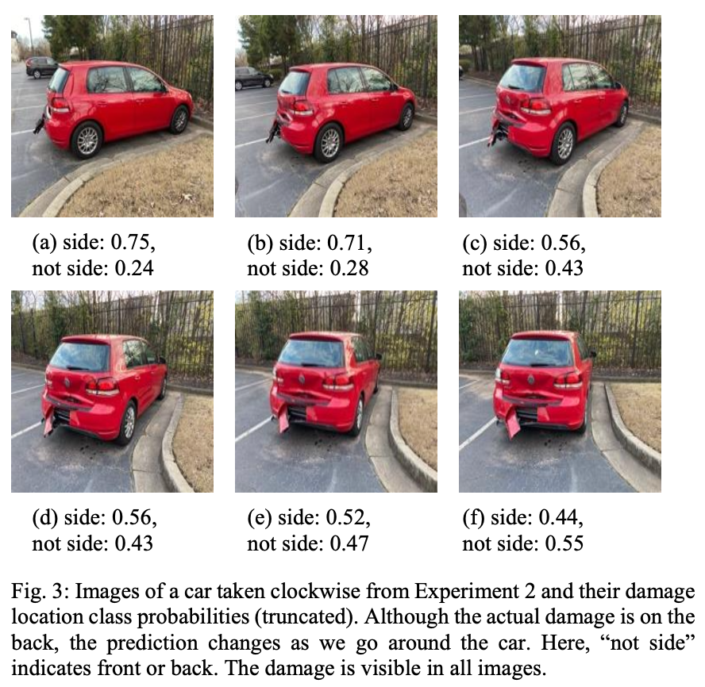

## Project Name 
ResNet Does Not Perform Intelligent Understanding of Picture in Image Recognition

## Summary
Found through experiments and theoretical considerations that ResNet recognizes local patterns, instead of global object shapes, and exploits spurious correlations. 

IEEE paper link: https://ieeexplore.ieee.org/document/9844486  
Selected code in notbooks.  

  

## Acknowledgements
My code is largely based on the PyTorch tutorials below: 
https://pytorch.org/tutorials/beginner/transfer_learning_tutorial.html 
https://pytorch.org/tutorials/beginner/basics/data_tutorial.html 
It is a combination of lines directly from the above tutorials (or slightly modified) and my own. Also inspired by the fine_tune() method from fast.ai

